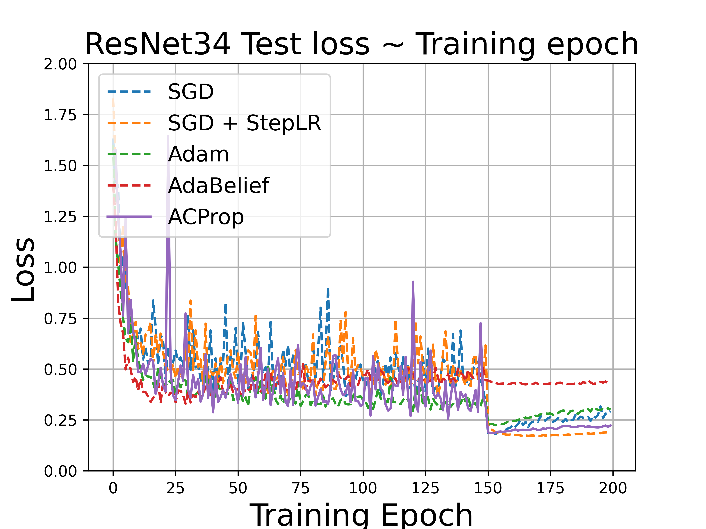

<h1 align="center">Adaptive Gradient Methods</h1>

## Reproduce the results
To reproduce the results just execute `run.sh` file. It installs all dependencies, runs all of the models, and stores the plots of the curves in `imgs` folder
```
bash run.sh
```

### Results on Image Recognition
<p align="center"> ResNet18 on CIFAR10 <p> 
<p align="center">
 
<p>
<p align="center">
  
</p>

<p align="center"> ResNet34 on CIFAR10 <p> 
<p align="center">
 
<p>
<p align="center">
  
</p>

## Used following papers
```
@article{zhuang2020adabelief,
  title={AdaBelief Optimizer: Adapting Stepsizes by the Belief in Observed Gradients},
  author={Zhuang, Juntang and Tang, Tommy and Ding, Yifan and Tatikonda, Sekhar and Dvornek, Nicha and Papademetris, Xenophon and Duncan, James},
  journal={Conference on Neural Information Processing Systems},
  year={2020}
}

@inproceedings{NEURIPS2021_eddea82a,
 author = {Zhuang, Juntang and Ding, Yifan and Tang, Tommy and Dvornek, Nicha and Tatikonda, Sekhar C and Duncan, James},
 booktitle = {Advances in Neural Information Processing Systems},
 editor = {M. Ranzato and A. Beygelzimer and Y. Dauphin and P.S. Liang and J. Wortman Vaughan},
 pages = {28249--28260},
 publisher = {Curran Associates, Inc.},
 title = {Momentum Centering and Asynchronous Update for Adaptive Gradient Methods},
 url = {https://proceedings.neurips.cc/paper/2021/file/eddea82ad2755b24c4e168c5fc2ebd40-Paper.pdf},
 volume = {34},
 year = {2021}
}
```
